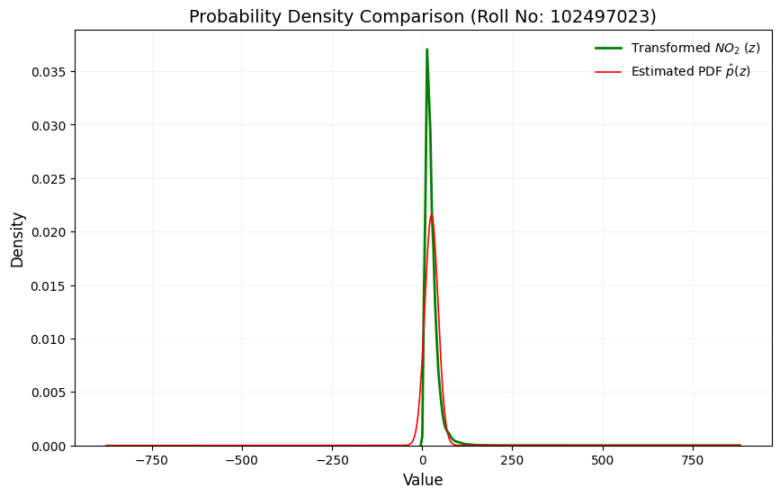

## Assignment-3: Probability Density Function Estimation & Data Modeling

## 1. Task Description

The objective of this assignment is to model environmental sensor data ($NO_2$) using a variation of the Gaussian Probability Density Function (PDF). The task involves:   
(a) Mapping the original feature $x$ to a transformed variable $z$ using a roll-number-dependent sine function. 
(b) Deriving the normalization constant $c$ and finding the Maximum Likelihood Estimators (MLE) for parameters $\mu$ and $\lambda$. 
(c) Learning the parameters from the dataset and visualizing the resulting smooth Gaussian profile. 

## 2. Methodology

### 2.1 Data Transformation ($x \rightarrow z$)

The transformation function is defined as:
$$z = T_{r}(x) = x + a_r \sin(b_r x)$$

Constants for Roll Number 102497023:
- $a_r = 0.05 \times (102497023 \pmod 7) = \mathbf{0.3}$
- $b_r = 0.3 \times (102497023 \pmod 5 + 1) = \mathbf{1.2}$

The addition of the sine term introduces a periodic "wiggle" (oscillatory shift) to the $NO_2$ distribution, simulating a non-linear data drift.

### 2.2 Parameter Learning (MLE)

The transformed data is modeled using the PDF: 
$$\hat{p}(z) = c \cdot e^{-\lambda(z-\mu)^2}$$
  Through Maximum Likelihood Estimation, the following optimal parameters were derived:
- **Location ($\mu$):** The sample mean of $z$, capturing the central tendency.
- **Precision ($\lambda$):** Calculated as $1/(2\sigma^2)$, capturing the dispersion of the transformed data.
- **Normalization ($c$):** Derived via the Gaussian Integral as $\sqrt{\lambda/\pi}$ to ensure a valid PDF area of 1.

## 3. Input/Output

**Input:** India Air Quality Dataset (Kaggle), specifically the `no2` feature.
 **Data Source:** [Kaggle] [Click here](https://www.kaggle.com/datasets/shrutibhargava94/india-air-quality-data)

**Output:** Learned parameters $(\mu, \lambda, c)$ and a density comparison visualization.

## 4. Results

| Parameter | Learned Value |
|---------|---------------|
| Location $\mu$| 25.803054 |
| Precision $\lambda$ | 0.001459 |
| Normalization $c$  | 0.021554 |

- The learned PDF exhibits a smooth Gaussian profile as expected.
- The estimated PDF $\hat{p}(z)$ shows a high degree of alignment with the transformed data distribution, validating the Maximum Likelihood Estimation (MLE) approach.
- The resulting bell curve effectively re-profiles the environmental feature $NO_2$ after the roll-number-parameterized non-linear shift ($a_r=0.3, b_r=1.2$), confirming the robustness of the derived estimators.
  

